# 💰 Finance Dashboard (React)

A responsive Finance Dashboard built using **React + Tailwind CSS**, featuring transaction management, analytics, and dark/light mode.

---

## 🚀 Features

* 📊 Dashboard Overview
* 📈 Analytics & Trends
* ➕ Add / Edit / Delete Transactions
* 🌙 Dark / Light Mode
* 🔐 Role-based UI (Admin / Viewer)
* 📱 Fully Responsive Design
* 🔍 Search & Filter (optional enhancement)
* 📤 Export (CSV / JSON)

---

## 🧠 Key Concepts Used

* React Hooks (`useState`, `useEffect`)
* Component-based architecture
* Conditional rendering
* Responsive design with Tailwind CSS
* State management for transactions
* Form handling (Add/Edit modal)

---

# 🧠 Approach

The Finance Dashboard is built using a **component-based architecture in React**, focusing on clean UI, responsive design, and dynamic data handling.

---

## 🏗️ 1. Component Structure

The application is divided into reusable components:

* **Navbar** → Handles navigation, role selection, and dark/light mode
* **Dashboard** → Displays summary and charts
* **TransactionTable** → Shows transaction data in a structured table
* **AddTransactionModal** → Handles adding and editing transactions
* **Charts (Recharts)** → Visual representation of financial data

This separation improves **maintainability and scalability**.

---

## 🔄 2. State Management

State is managed using React Hooks:

* `useState` → For managing:

  * Transactions list
  * Form data
  * Active tab
  * Dark mode
* `useEffect` → For:

  * Prefilling form in edit mode
  * Resetting form when adding new transaction

---

## 📊 3. Data Handling

Each transaction follows a consistent structure:

```js
{
  id,
  transaction,
  category,
  amount,
  type,   // "income" or "expense"
  date
}
```

### Key Logic:

* Filter transactions based on type (income/expense)
* Calculate totals using `reduce()`
* Group data by month for trend analysis

---

## 📈 4. Charts Integration

Charts are implemented using **Recharts**:

* **Pie Chart** → Income vs Expense
* **Line Chart** → Monthly trends

### Approach:

* Transform transaction data into chart-friendly format
* Use `ResponsiveContainer` for responsiveness
* Apply conditional styling for dark/light mode

---

## 📱 5. Responsive Design

Tailwind CSS is used to ensure responsiveness:

* Flexbox & Grid for layout
* `overflow-x-auto` for table and tabs
* `whitespace-nowrap` to prevent layout breaking
* Mobile-first design approach

---

## 🌙 6. Dark / Light Mode

* Implemented using conditional Tailwind classes
* UI dynamically switches based on `dark` state
* Ensures readability and consistent design

---

## ✏️ 7. Add / Edit Transaction Logic

* Single modal used for both add and edit
* Controlled form inputs using state
* `editData` determines mode:

  * If present → Edit mode
  * If null → Add mode
* Form resets when adding new transaction

---

## ⚠️ 8. Challenges & Fixes

### ❌ Issue: Inconsistent data keys (`Type` vs `type`)

✔ Fixed by standardizing all keys to lowercase

### ❌ Issue: Hooks error (order of hooks)

✔ Ensured hooks are always called at the top level

### ❌ Issue: Mobile layout breaking

✔ Solved using horizontal scroll and responsive classes

---

## 🚀 9. Performance & Best Practices

* Used reusable components
* Avoided unnecessary re-renders
* Maintained consistent data structure
* Followed React Hooks rules strictly

---


# 📊 Charts & Data Visualization

This project includes interactive charts built using **Recharts** to visualize financial data effectively.

---

## 📈 Income vs Expense (Pie Chart)

* Displays total income vs total expenses
* Helps users quickly understand spending vs earnings
* Color-coded:

  * 🟢 Income
  * 🔴 Expense

### 🔧 Implementation

```jsx
<PieChart>
  <Pie data={data} dataKey="value" />
</PieChart>
```

---

## 📉 Monthly Trends (Line Chart)

* Shows income and expense trends over months
* Helps in analyzing financial patterns
* Two lines:

  * 🟢 Income trend
  * 🔴 Expense trend

### 🔧 Implementation

```jsx
<LineChart data={data}>
  <Line dataKey="income" />
  <Line dataKey="expense" />
</LineChart>
```

---

## 📱 Responsive Charts

* Built using `ResponsiveContainer`
* Automatically adjusts to all screen sizes
* Works smoothly on mobile, tablet, and desktop

```jsx
<ResponsiveContainer width="100%" height={300}>
```

---

## 🌙 Dark / Light Mode Support

Charts adapt to theme:

* Axis colors change based on mode
* Background matches dashboard theme

---

## 📊 Data Processing Logic

* Transactions are filtered into:

  * Income
  * Expense
* Monthly grouping done using JavaScript Date API

```js
const month = new Date(t.date).toLocaleString("default", {
  month: "short",
});
```

---

## 🚀 Future Enhancements

* 📊 Category-wise bar chart
* 📅 Weekly trends
* 📉 Expense breakdown insights
* 🎯 Animated charts

---

## 📱 Responsive Design Approach

### Problem

Tabs were breaking layout on smaller screens.

### Solution

* Used `overflow-x-auto` for horizontal scrolling
* Applied `whitespace-nowrap` to prevent text wrapping
* Reduced padding on mobile using responsive classes

```jsx
<div className="flex gap-3 overflow-x-auto no-scrollbar">
```

### Result

* Smooth scrolling tabs on mobile
* Clean layout across all screen sizes

---

## 🌙 Dark / Light Mode

Implemented using conditional Tailwind classes:

```jsx
dark
  ? "bg-gray-900 text-white"
  : "bg-white text-black"
```

---

## 📦 Data Structure

Each transaction follows a consistent format:

```js
{
  id: number,
  transaction: string,
  category: string,
  amount: number,
  type: "income" | "expense",
  date: string
}
```

---

## ⚠️ Common Issues Fixed

* ❌ Mixing `Type` and `type`
* ❌ Hooks used conditionally
* ❌ Layout breaking on mobile
* ❌ Hardcoded colors not supporting light mode

---

## 🛠 Tech Stack

* React.js
* Tailwind CSS
* React Icons

---

## 📌 Future Improvements

* Charts integration (Recharts)
* Backend API integration
* Authentication
* Pagination & sorting
* Mobile card layout for transactions

---

# 📸 Screenshots


### Dashboard
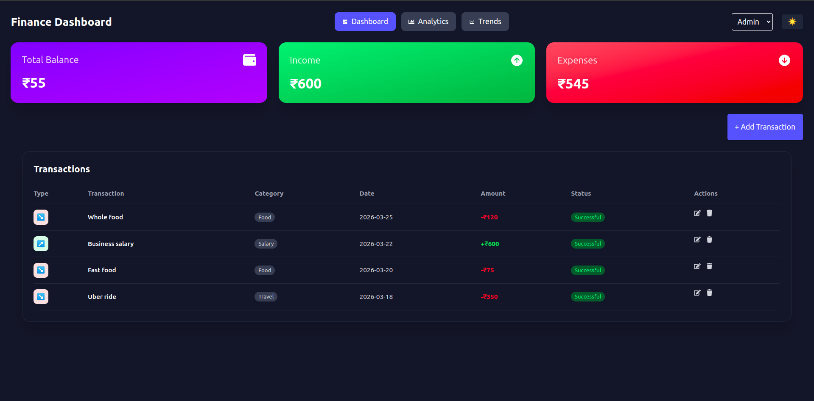

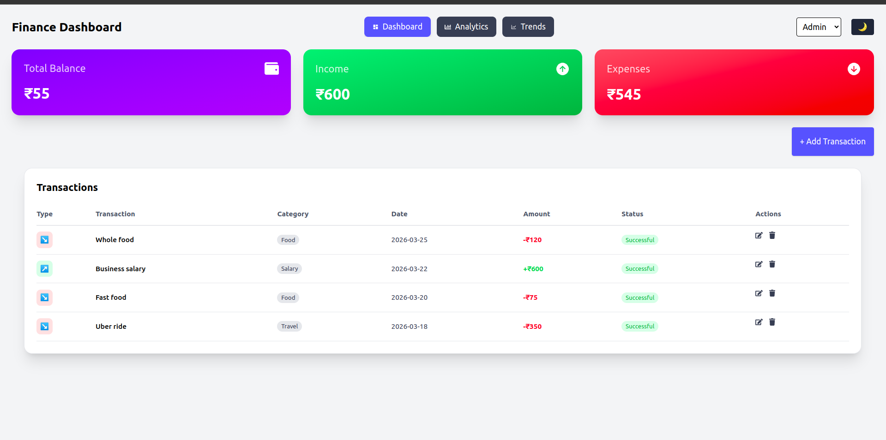

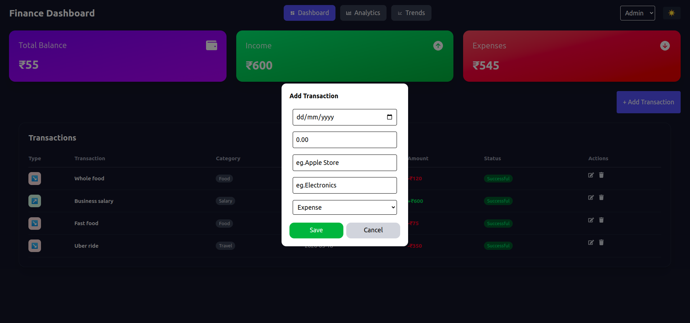

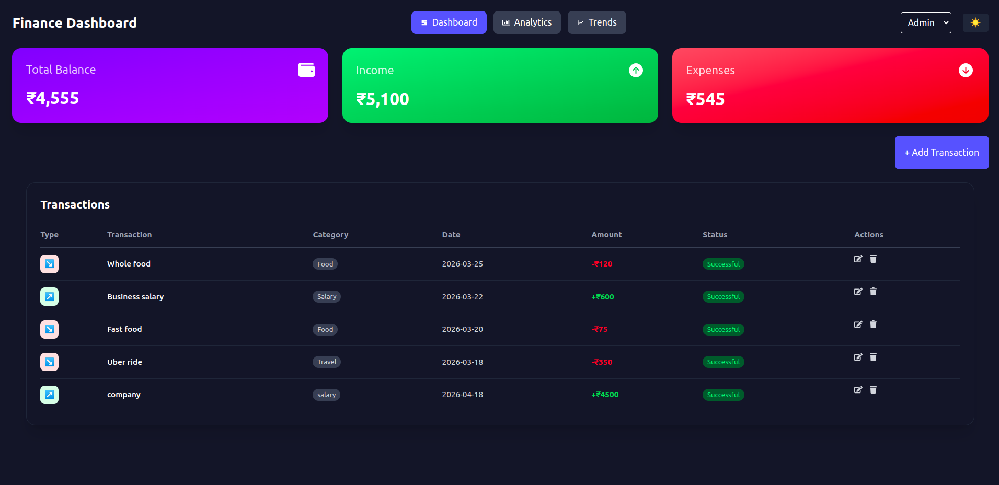

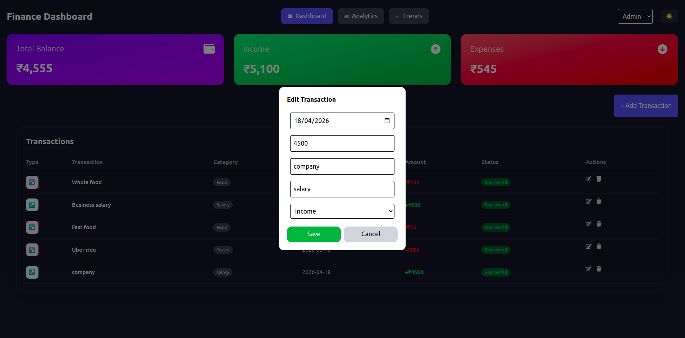

### Analytics Page
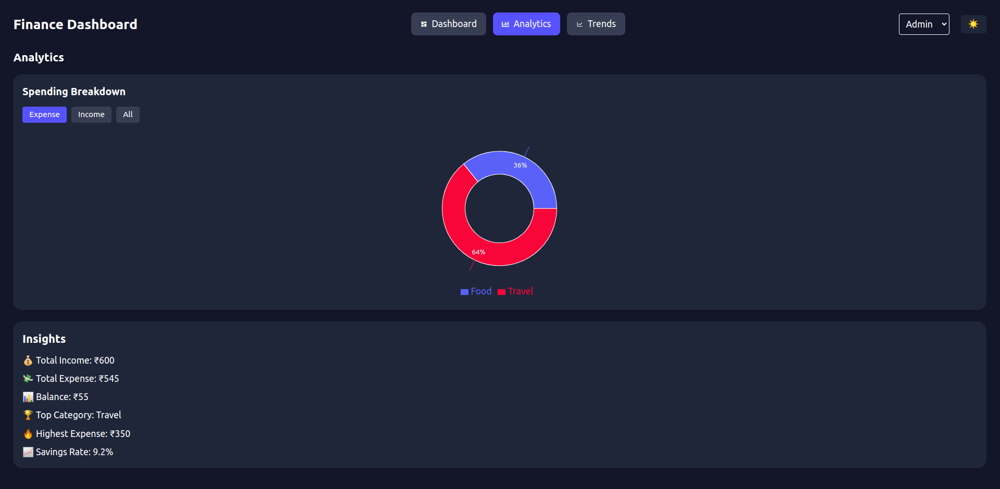

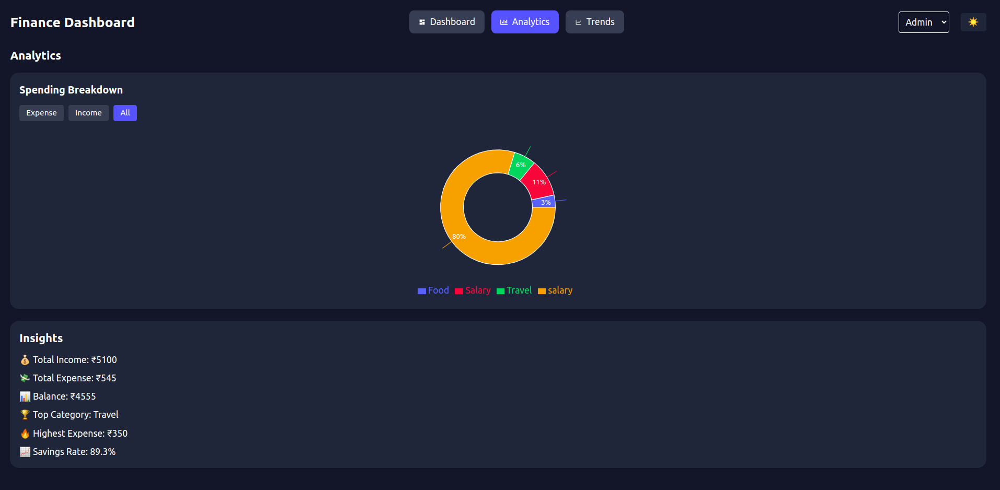

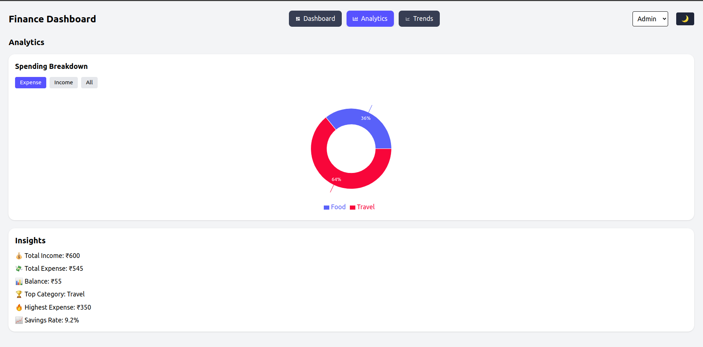

### Charts View
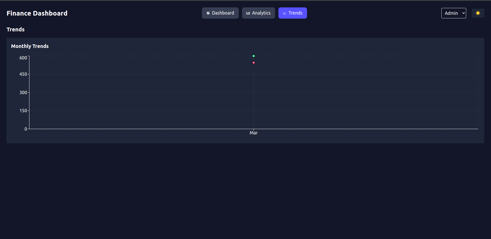

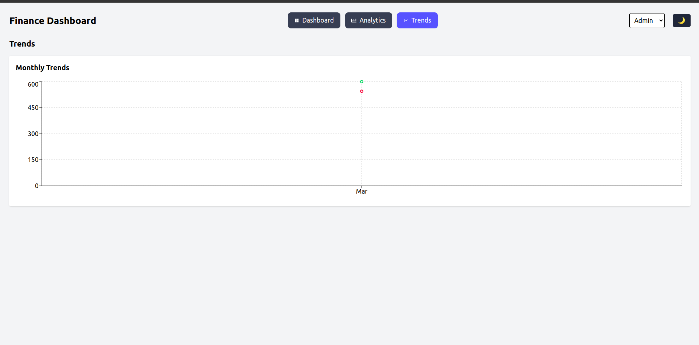

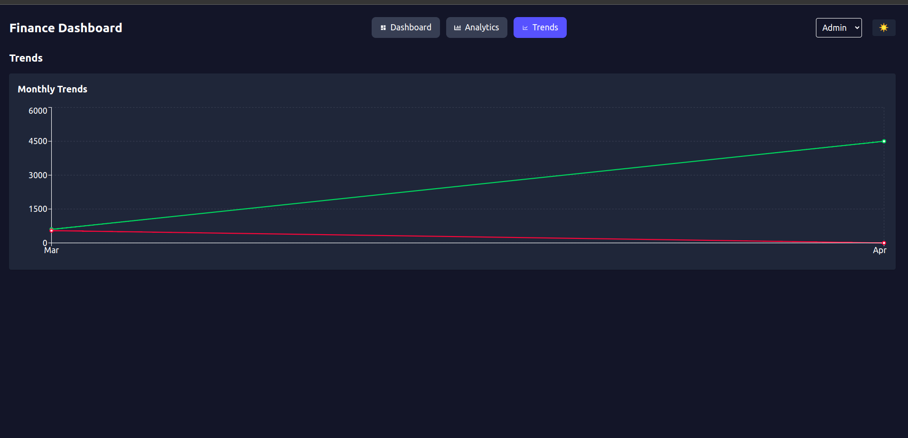

### Role - Viewer

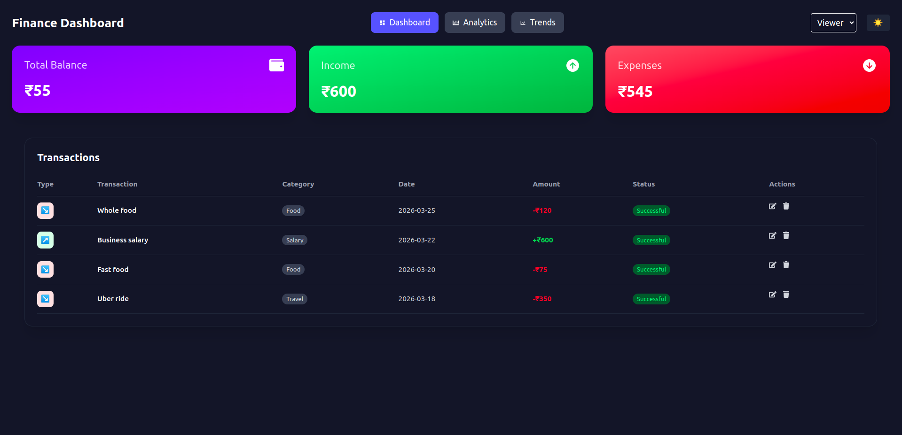

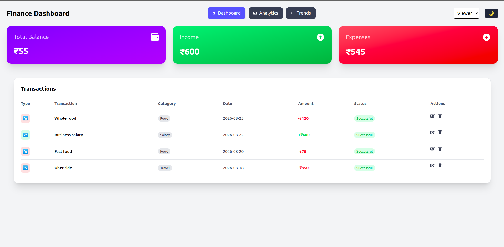

### Mobile View

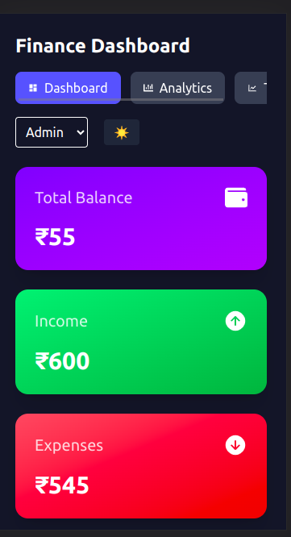

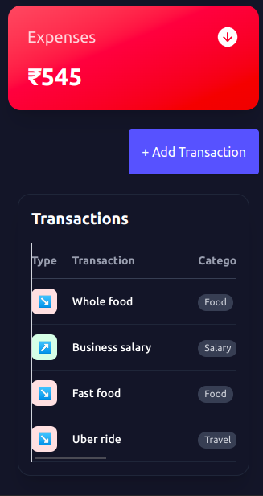

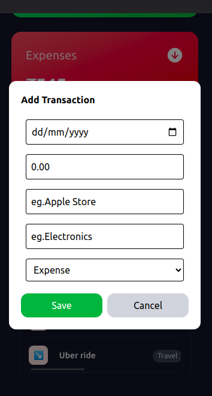

## 💡 Author

Virshree Desai
Frontend Developer (React)

---
